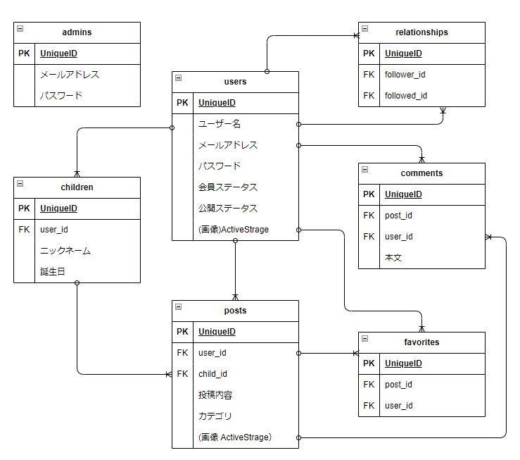
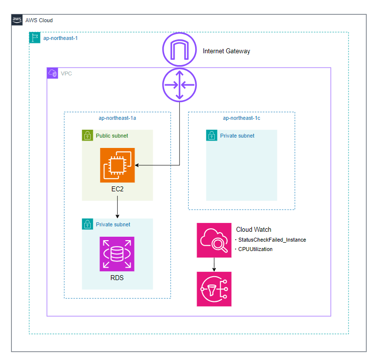

# Tete-Tsunago

​
## サイト概要
### サイトテーマ
忙しい保護者の皆さまがお子様の「初めて」と「最後」を記録して、かけがえのない日々を振り返るSNS

### テーマを選んだ理由
子供が1歳になる直前、初めて立った日のことはよく覚えていますが、その一方でハイハイをしなくなった日のことを覚えていません。  
周囲の子育て経験者に聞いても、いつが最後のハイハイだったのか覚えている方はおらず、そして皆切なそうに懐かしみます。  
そこで、敢えて「初めて」だけではなく「最後」も記録できるサービスを考えました。  
今では抱っこ要求に頭を悩ませる日々ですが、これもいつか最後が来ると思うと頑張れるものです。  
日々謀殺される子育てのなかでいつもと異なる視点でお子様の成長を振り返り、ちょっと一息ついて再びお子様と向き合うその一助になればとこのテーマを選びました。

### ターゲットユーザ
- お子様の成長記録を残したい方
- お子様の成長に嬉しさだけでなくさみしさも感じる方
- ほかのご家庭のお子様の成長を見守りたい方

### 主な利用シーン
- お子様の成長について記録したいとき
- お子様の成長記録を見返したいとき
- 他人が投稿した成長記録をお祝いするとき

## 設計書
- ER図  

- AWS構成図  

- [インフラ設計書](https://docs.google.com/spreadsheets/d/1-WK3dRqq2QA5w3LQOMSQHu-2NkhRPsSgM5uuwsBDHog/edit?usp=sharing)

## 開発環境
- OS：Linux(AmazonLinux2)
- 言語：HTML,CSS,JavaScript,Ruby,SQL
- フレームワーク：Ruby on Rails
- JSライブラリ：jQuery
- IDE：Cloud9

## 使用素材
- [ICOON MONO](https://icooon-mono.com/)
- [EC design](http://design-ec.com/)
- [photoAC](https://www.photo-ac.com/)